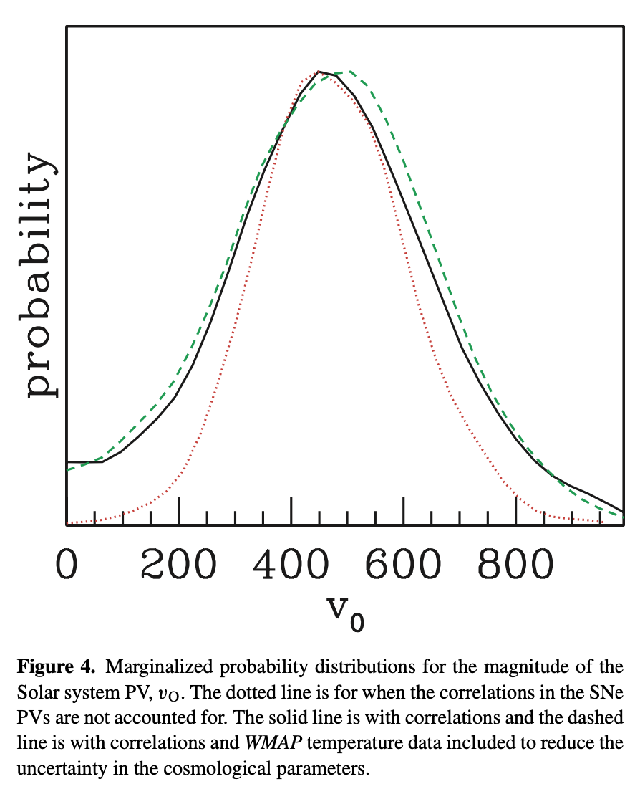

👋 Hi everybody!

My name's Andrew. Igloo comes from my grandfather's last name, Iglinski. I'm a kinda-former engineer with a background in, and a passion for, physics. One evening a little over two years ago, I was reading over some of Einstein's work for probably the 15th time, when something occurred to me. He made an assumption that only made sense in the days before our observations of cosmic inflation.

If we discounted this assumption, we can produce every single experimental validation of both the specialized and generalized theories of relativity without the need for time dilation, therefore preserving synchronicity between reference frames.

I quickly began to accept less work and focus more on this model of relativity than paid software work, and in the process I became homeless. Over the past 2 years that I've been homeless, I continued to focus on this geometry, and was able to derive several physical quantities through this theory alone that align nearly perfectly with direct observation in a manner that is entirely unaccounted for by current models of relativity.

First, I was able to produce a peculiar velocity of:

$$
v_o = c \sqrt{1 - \frac{1}{(\frac{1}{R}\int_0^{R} 2 G \frac{M}{R^{3}})^{2}}} = 526.6 ~ \text{km} ~ \text{s}^{-1}
$$

Not only was this value produced through **_local_** gravitational observations as they apply to this geometry, this value fits almost perfectly on top of probability curves found through direct observation:[^1]

Second, I was able to produce a relative spatial dilation of $\frac{ds}{dx} = 1.61800103 = \Phi + 0.002\%$.

While the first of two papers was submitted for peer review 2 days ago, I am currently in the process of finalizing my second paper relating this model to electromagnetism with possibly even more observationally sound results.

## Uh Little Less Dum

Throughout the time that I was working on my own research, I became increasingly frustrated with existing note taking options. Some offered the ability to run calculations and generate plots directly in your notes but fell far short in regards to searching, linking, and the overall academic workflow. Others offered great tagging and linking features, but failed to allow the customizability that I needed, and _all_ of the existing options failed to deliver the ability to completely contain my notes which included task lists, calendars, snippets, equations, and of course, regular [mdx](https://mdxjs.com/).

About half way through my journey I gave up with existing options and started to build my own app, originally for my personal use. However, as this app continued to grow and expand to meet my own needs, I realized that this app could be beneficial to a user base that extends far beyond my own personal use case.

I've spent the past couple months reworking this application into a slot style, plugin based architecture and am now getting ready to release it to the public. While I'd of course love any support that user's or potential partners can provide, I am _still_ homeless after all, this app is now and will always be free for user's running it on their own machine.

### Progress and Release Date of ULLD

The main application is completely done and has been done for quite some time. Because of my current living situation mentioned above and the inherent lack of internet and battery power that comes with living in a barely running car, the final 2-3% of this process that involves remote hosting and working with remote packages is proving to be quite time consuming.

If current hosting issues can be resolved, the build script should be available for a beta release in July of 2024, with a completely refined application available for full release sometime in the fall or early winter of 2024 as well.

You can follow the progress [here](uhlittlelessdum.com), but the site is currently quite a bit behind the actual progress of the application as hosting issues continue to be a significant limitation.

[^1]: Image taken from **'Determining the motion of the Solar system relative to the cosmic microwave background using Type Ia supernovae'** in the _Monthly Notices of the Royal Astronomical Society_. Credit goes to Christopher Gordon, Kate Land and Anže Slosar. The full paper is available [here](https://doi.org/10.1111/j.1365-2966.2008.13239.x)
